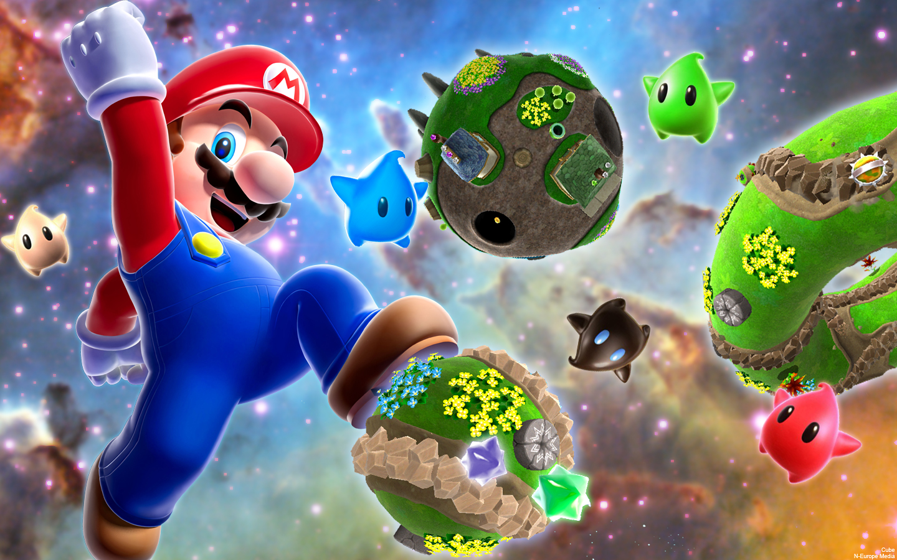
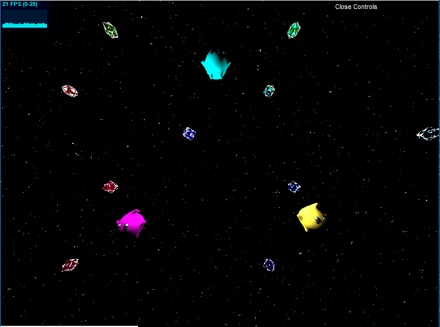

# Homework 3: Super Wahoo Galaxy
Jake Snipes

PennKey: jsnipes

## Images

Reference: *Super Mario Galaxy* Series

Welcome to the Implicit Galaxy!

## Techniques
### Starry Background
The background was created using modified multi-octave 3D FBM noise sampled three times and animated by adding a simple time dependence (note how the stars gently twinkle). A noise threshold was set such that if a fragment's noise value fell below this, its color was set to black. Otherwise, its color remained as is. Further, a falloff radius was added so that fewer stars appear farther from the center of the screen.

### Starbits
The starbits were created using a smooth blend of rounded octahedron and cube SDFs. Their material is a unique glossy shader that makes use of a combination of Lambertian, Blinn-Phong, and Fresnel shading. This combination achieves an interesting, unique rim lighting effect. The starbits were then replicated, staggered, and animated using rotations and translations so many cascade through the scene, twinkling in the lights.

### Lumas
Your guide to the Implicit Galaxy, these three friendly Lumas were created with smooth blends of numerous SDFs. Their main body is a sphere, and their arms, legs, and curl are rounded cones with various transformations applied. The arms and legs make use of rotations, translations, and symmetry while the curl makes use of a translation and twist. Their eyes are capsule SDFs and are actually separate objects from the body, as they use a different shading model. The eye material is a simple Blinn-Phong, while the main body material uses subsurface scattering that is calculated using the ambient occlusion factor within the SDF so the lumas glow. Finally, these three little guys are animated with simple parametric functions to bring them to life.

### Overall Scene
The scene as a whole makes use of soft shadowing and ambient occlusion in combination with three-point lighting to achieve a polished look.

## Live Demo
http://jacobsnipes.com/hw03-environment-setpiece

## Resources Used
All resources are cited as comments in the code where they were used
